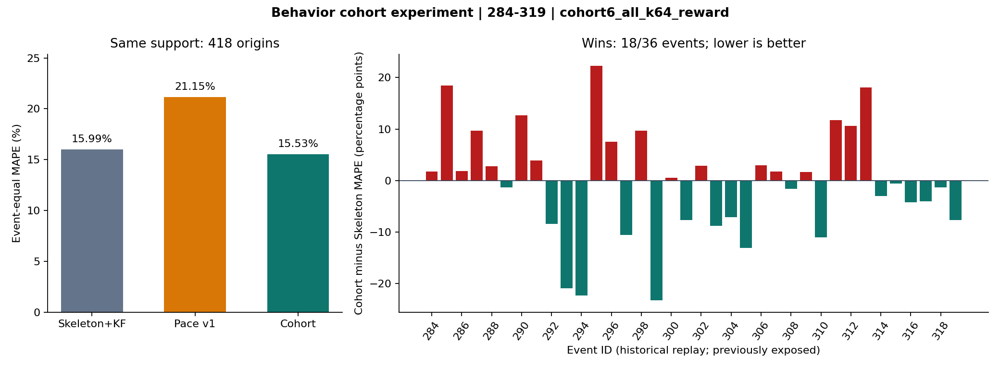

# 2026-09-08 行为群体投入模型实验结果

本轮明显改善了旧行为模型，整体 MAPE 接近 Skeleton 并略低；但 MAE、sMAPE 和核心 T1000 仍较差，配对差值也没有显著优势。保留为实验模型，生产继续使用 Skeleton+KF。

选定模型：`cohort6_all_k64_reward`。主比较为 284–319 的同 origin、同档位支持集。

| 方法 | MAPE | MAE（万） | sMAPE | 平均偏差 | origin |
|---|---:|---:|---:|---:|---:|
| Skeleton+KF | 15.99% | 128.52 | 14.46% | +7.98% | 418 |
| 原 Pace | 21.15% | 194.02 | 24.57% | -20.21% | 418 |
| 新行为 Cohort | 15.53% | 135.73 | 17.92% | -14.29% | 418 |

新模型减 Skeleton 的活动等权 MAPE 差为 -0.45 个百分点；36 场范围内实际参与配对 36 场，新模型胜 18 场。按活动整块 bootstrap 2,000 次，差值 95% 区间 [-3.89, +3.03] 个百分点。
这描述本组历史活动的抽样不确定性，不是未来预测区间，也不能消除过去开发曝光的影响。



## 全部可用输入与失败

每行使用该方法自身可用支持；方法强弱以上方配对表为准。

| 方法 | MAPE | MAE（万） | sMAPE | 平均偏差 | origin |
|---|---:|---:|---:|---:|---:|
| 新行为 Cohort | 15.84% | 135.15 | 18.28% | -14.75% | 466 |
| 原 Pace | 21.64% | 194.26 | 25.16% | -20.85% | 466 |
| Skeleton+KF | 15.99% | 128.52 | 14.46% | +7.98% | 418 |
| 奖励换线 Skeleton | 18.85% | 142.94 | 16.36% | +12.28% | 371 |
| 最后两点斜率 | 25.09% | 214.91 | 28.69% | -15.60% | 466 |
| 累计均速 | 28.84% | 256.30 | 34.60% | -27.95% | 466 |
| Persistence | 61.45% | 506.50 | 95.40% | -61.45% | 466 |

共计划 468 个 origin，输入失败 2 个，新模型运行失败 0 个。Skeleton 缺失输出保留原报告状态。

## 分档位与阶段

均在 Skeleton 同支持集上聚合；早/中/晚为真实活动进度的三等分。

| 切片 | 新模型 MAPE | 原 Pace MAPE | Skeleton MAPE | 配对 origin |
|---|---:|---:|---:|---:|
| T500 | 11.36% | 13.96% | 11.37% | 67 |
| T1000 | 18.06% | 24.64% | 17.18% | 219 |
| T1500 | 13.66% | 21.59% | 19.49% | 26 |
| T2000 | 8.08% | 11.47% | 13.07% | 106 |
| early | 28.15% | 27.29% | 28.95% | 116 |
| middle | 15.06% | 23.92% | 16.55% | 148 |
| late | 7.47% | 14.36% | 6.29% | 154 |

## 开发选择与内部确认

候选训练池为 192–239；每次预测再按真实时间剔除尚未结束的历史。240–263 先选择下表预先列明的 12 个候选，再检验一次奖励迁移机制修正；共 13 个开发候选。264–283 在选定后一次确认。历史复验前把选定结构用 192–283 重拟合。没有按 284–319 的分数再搜索。

| 开发候选 | MAPE | 偏差 | origin |
|---|---:|---:|---:|
| pace_v1 | 13.74% | -11.63% | 186 |
| cohort6_all_k64 | 17.96% | -17.63% | 186 |
| pace3_all_k64 | 18.22% | -18.08% | 186 |
| pace3_all_k16 | 19.25% | -19.17% | 186 |
| pace3_type_k64 | 19.42% | -19.30% | 186 |
| cohort6_all_k16 | 19.72% | -19.62% | 186 |
| cohort6_type_k64 | 19.75% | -19.54% | 186 |
| pace3_all_k0 | 20.37% | -20.29% | 186 |
| pace3_type_k16 | 20.64% | -20.56% | 186 |
| cohort6_all_k0 | 21.32% | -21.32% | 186 |
| pace3_type_k0 | 21.38% | -21.32% | 186 |
| cohort6_type_k16 | 21.55% | -21.51% | 186 |
| cohort6_type_k0 | 22.45% | -22.45% | 186 |
| cohort6_all_k64_reward（最终选定） | 13.04% | -10.94% | 186 |

| 阶段 | 选定新模型 MAPE | 原 Pace MAPE | origin |
|---|---:|---:|---:|
| 开发 240–263 | 13.04% | 13.74% | 186 |
| 确认 264–283 | 17.16% | 18.61% | 142 |
| 历史复验 284–319 | 15.84% | 21.64% | 466 |

repair：已加载活动的 187 个计划 origin 中，输入不足 1 个、模型拒绝非法前缀 0 个。

confirm：已加载活动的 147 个计划 origin 中，输入不足 1 个、模型拒绝非法前缀 4 个。

confirm 排除事件 280：event 280 reward tiers lack a first post-end HHWX bucket: [1000]。不计作成功或零误差。

confirm 排除事件 282：event 282 reward tiers lack a first post-end HHWX bucket: [1000]。不计作成功或零误差。

replay：已加载活动的 468 个计划 origin 中，输入不足 2 个、模型拒绝非法前缀 0 个。

## 数学与数据解释

每条历史档线先拟合终局投入份额 m，满足 m≥0、各项之和为 1。三分量版本使用归一到终值 1 的旧 pace 基函数；六分量版本使用持续参与、两类指数退出与三类截止激活。形状定义在累计昼夜可用时间上，自动随活动时长伸缩。

每个历史事件先贡献同等先验质量，事件内按 log-rank 距离加权；前缀每 6 小时的相对投入分布通过 KL 广义似然更新权重。各模板先在目标档末次可见分数处定标，再平均预测曲线。强度 0 是取消前缀更新的消融。

最终拟合保留 462/552 条历史档线，来自 89/92 个候选训练活动。缺少结束后 20 分钟内首个终值或终值与此前最高分冲突的档线显式排除；其余训练 revision 沿用既有因果 cummax 规则。运行时输入下降仍明确失败。

旧 pace 的速度系数平均、终局投入份额平均和预测增长倍数平均并不等价。本轮同时改变拟合损失、有效终值支持、rank 条件化及前缀更新，因此不能把全部成绩差异归因于其中单一因素。开发集的 k=0/16/64 对照能单独比较固定其余结构时前缀更新的作用。

首轮开发失败后发现终值归一化没有把历史奖励条件迁移到目标档。唯一追加版本保留已选参数，用旧 pace 原有压力函数把 deadline 份额乘 P_target/P_history 后归一。它不增加待调参数，开发误差单独列在表中。

这仍是行为启发的固定排名群体模型，不是可识别的个体玩家模拟器。六分量的退出与激活比例也不能当成真实玩家统计。新奖励档使用自己的观测定标；历史 rank 平滑传递的是曲线形状，未读取目标其他榜线作为分数替身。

## 复现与边界

```powershell
.\venv\Scripts\python.exe scripts/experiment_behavior_cohorts.py screen
.\venv\Scripts\python.exe scripts/experiment_behavior_cohorts.py repair
.\venv\Scripts\python.exe scripts/experiment_behavior_cohorts.py confirm
.\venv\Scripts\python.exe scripts/experiment_behavior_cohorts.py replay
.\venv\Scripts\python.exe scripts/report_behavior_cohorts.py
```

需要本地既有 192–319 缓存、原 pace 先验及原 284–319 评估 JSON。新结果冻结逐 origin 预测、真值、输入摘要、选型配置和最终先验。复验核对目标缓存 SHA、终值及旧 pace 数值后复用原 Skeleton 预测，没有重新联网请求 T10。原报告部分 T10 原始响应未冻结，仍是旧 baseline从头复算的边界；本轮新模型不用 T10。

284–319 已被上一轮开发查看，不能称作全新盲测。内部确认发生在更早的活动和旧奖励体系下，跨阶段差异是判断模型稳定性必须同时看的证据。本轮不改生产入口和 README，不启动 DL，也不把实验胜负自动变成上线结论。
